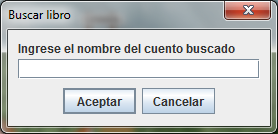

# Enunciado

La fundación cupi2 está realizando una campaña por la educación. La campaña
incluye la venta de cuentos infantiles y se donará todo el dinero recibido en
las ventas. Se desea tener una aplicación que permita consultar información de
los libros en venta, comprar un libro y además ver el progreso de las ventas.

Por cada uno de los libros se manejará la siguiente información: Nombre,
cantidad de páginas, precio, cantidad de unidades que han sido vendidas y
la imagen de la portada.
La información de cada libro se carga de un archivo de texto.
La aplicación debe:

1. Mostrar la información detallada de un libro
2. Permitir al usuario recorrer todos los libros de cuentos infantiles.  Es decir,
avanzar y retroceder sobre los libros, ir al primer libro e ir al último libro.
Si el usuario intenta retroceder, encontrándose en el primer libro, la aplicación
debe mostrar un mensaje informándole lo sucedido. Igualmente, si el usuario intenta
avanzar, encontrándose en el último libro, la aplicación debe mostrar el mensaje
respectivo.
3. Permitir al usuario buscar un libro por nombre y mostrar su información. Si el
libro no existe, la aplicación debe informar al usuario.
4. Permitir que el usuario compre un libro. 
5. Mostrar la información del libro más vendido. Si hay más de un libro que cumple
con esa condición, se muestra el libro con mayor precio.
6. Mostrar la información del recaudo conseguido hasta el momento. 

A continuación se muestran las características de la interfaz y algunos mensajes. 

# Interfaz

La interfaz presenta la información del libro seleccionado por el usuario,
la información del libro más vendido y la información de recaudo. Si ningún
libro ha sido vendido, la interfaz no muestra información relacionada con el
libro más vendido.

Después de la venta del primer libro, y de allí en adelante, se muestra el nombre
del libro más vendido y la cantidad de unidades que se han vendido de ese libro.

Ventana para buscar un libro de cuentos por nombre:

Mensaje que se presenta si el usuario intenta ir al primer libro o al libro
anterior estando en el primer libro:

Mensaje que se presenta si el usuario busca un libro que no existe:

